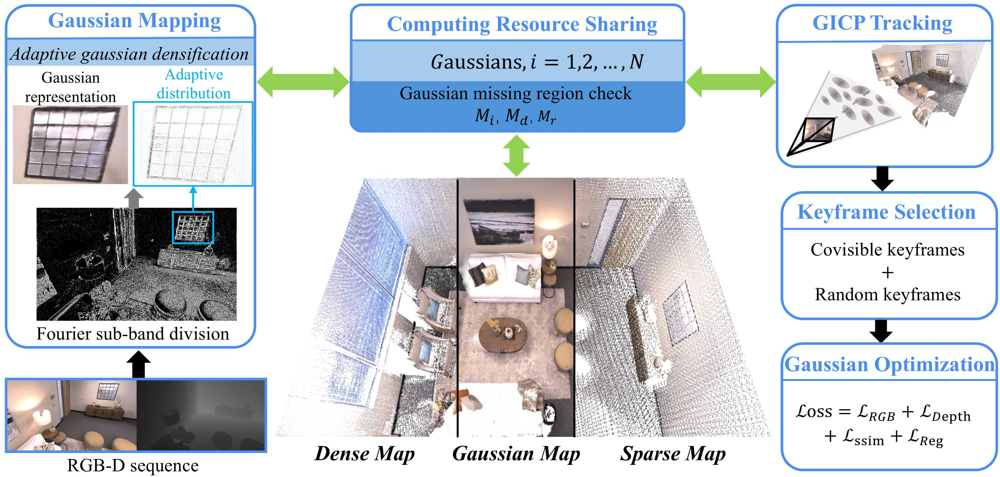

<p align="center">
  <h1 align="center">🌟 FGS-SLAM: Fourier-based Gaussian Splatting for Real-time SLAM with Sparse and Dense Map Fusion</h1>
  <h3 align="center">IROS 2025 (Oral Presentation)</h3>
  <p align="center">
    <b>Yansong Xu</b> · <b>Junlin Li</b> · <b>Wei Zhang</b> · <b>Siyu Chen</b> · <b>Shengyong Zhang</b> · <b>Yuquan Leng</b><sup>∗</sup> · <b>Weijia Zhou</b><sup>∗</sup>
  </p>
  <p align="center">
    <a href="https://arxiv.org/pdf/2503.01109.pdf"></a>
    <a href="https://youtu.be/T7B6sZXAD6I"></a>
    <a href=""></a>
  </p>
</p>


<p align="center">
  <a href="">
    
  </a>
  <a href="">
    
  </a>
</p>

<br>

## 📌 Overview

FGS-SLAM is an advanced real-time SLAM system that combines Fourier-based Gaussian Splatting with sparse and dense map fusion for high-performance 3D reconstruction and localization.

## 🛠️ Installation

### Prerequisites

- NVIDIA GPU with CUDA 11.8 support
- Conda package manager

### Step-by-Step Setup

1. **Clone the repository**:
   ```bash
   git clone https://github.com/3DV-Coder/FGS-SLAM.git --recursive
   cd FGS-SLAM

2. **Create conda environment**:
   ```bash
   conda create -n fgsslam python==3.9
   conda activate fgsslam
   ```

3. **Install PyTorch**:
   ```bash
   conda install pytorch==2.0.0 torchvision==0.15.0 torchaudio==2.0.0 pytorch-cuda=11.8 -c pytorch -c nvidia
   ```

4. **Install requirements**:
   ```bash
   pip install -r requirements.txt
   conda install -c conda-forge python-pcl
   ```

5. **Install submodules**:
   ```bash
   pip install submodules/diff-gaussian-rasterization
   pip install submodules/simple-knn
   
   cd submodules/fast_gicp
   mkdir -p build && cd build
   cmake .. && make
   cd ..
   python setup.py install --user
   ```

## 📂 Datasets

### Replica Dataset
```bash
bash download_replica.sh

# Modify the directory structure
python reorganize_replica.py ./dataset/Replica	
```

### TUM-RGBD Dataset

```bash
bash download_tum.sh
```

## 🚀 Quick Start

### Running on Replica Dataset
```bash
bash replica_unlimit.sh
```

### Running on TUM-RGBD Dataset

```bash
bash tum_unlimit.sh
```

## 👀 Interactive Viewers

### SIBR Viewers (High-Quality Rendering)

1. **Install dependencies**:
   ```bash
   sudo apt install -y libglew-dev libassimp-dev libboost-all-dev libgtk-3-dev libopencv-dev libglfw3-dev libavdevice-dev libavcodec-dev libeigen3-dev libxxf86vm-dev libembree-dev
   ```

2. **Build the viewer**:
   ```bash
   cd SIBR_viewers
   cmake -Bbuild . -DCMAKE_BUILD_TYPE=Release # add -G Ninja to build faster
   cmake --build build -j24 --target install
   ```

3. **Run the system**:
   
   ```bash
   python -W ignore fgs_slam.py --dataset_path dataset/Replica/office0 --verbose
   ```
   
4. **In another terminal**:
   ```bash
   cd SIBR_viewers
   ./install/bin/SIBR_remoteGaussian_app --rendering-size 1280 720
   ```

### Rerun.io Viewer (Real-Time Visualization)
```bash
python -W ignore fgs_slam.py --rerun_viewer
```

## 🙏 Acknowledgements

We extend our gratitude to the following projects and their contributors for their foundational work and inspiration:

<p align="center"> 
    <a href="https://github.com/graphdeco-inria/gaussian-splatting"></a> 
    <a href="https://github.com/spla-tam/SplaTAM"></a> 
    <a href="https://github.com/Lab-of-AI-and-Robotics/GS_ICP_SLAM"></a> 
</p>
